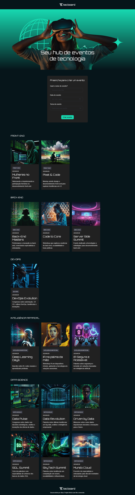
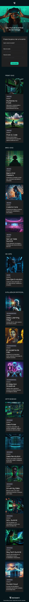

# Tecboard

This website simulates a technology platform focused on events, built as a single-page layout with no interactivity. The project was created to practice structure, layout, and visual organization commonly used in modern tech event websites.

The page includes a header, a hero section, a form section, a cards section to showcase content, and a footer.

---

## 📷 Screenshots

### Desktop


### Mobile


---

## 🚀 Technologies

- React

- Typescript

- Tailwind

- Vite

---

## 📦 How to use

1. Clone the repository:
```bash
git clone https://github.com/michaelprocha/tecboard
```

2. Dowloand [NodeJS](https://nodejs.org/en/download).

3. Install dependencies:
```bash
npm install
```

4. Run locally
```bash
npm run dev
```

---

## 👨‍💻 Author

Made by [Michael Rocha](https://github.com/michaelprocha)

---

## 📄 License

This project is licensed under the MIT License. See the LICENSE file for more details.